<!-- contribution graph: real data, regenerated daily by
     .github/workflows/update-profile-art.yml -->

<h3><code>himanshu@github ~ $ ./contributions.sh</code></h3>

 
 

<!-- portrait:  python scripts/prep_photo.py <photo> && python scripts/make_ascii_svg.py
     info card: edit ROWS in scripts/make_info_card.py, then run it -->

<h3><code>himanshu@github ~ $ whoami</code></h3>

<table>
<tr>
<td valign="top"></td>
<td valign="top"></td>
</tr>
</table>

 
 

<h3><code>himanshu@github ~ $ ./links.sh</code></h3>

<b>Full-Stack Web Developer · React / Next.js / Node.js · Cloud</b>

 

